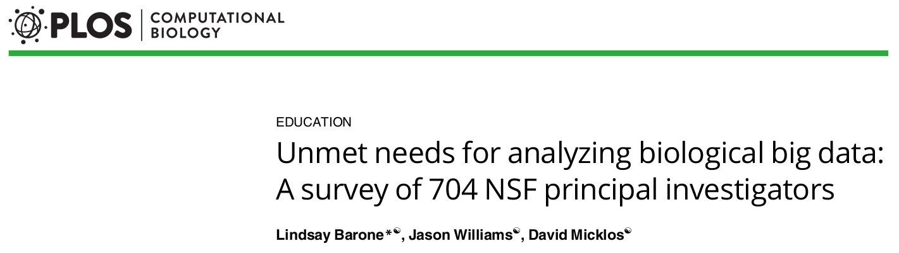
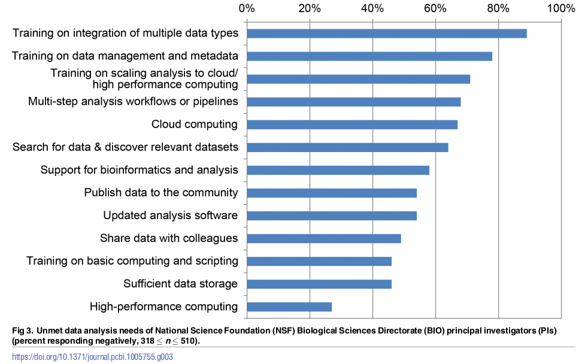
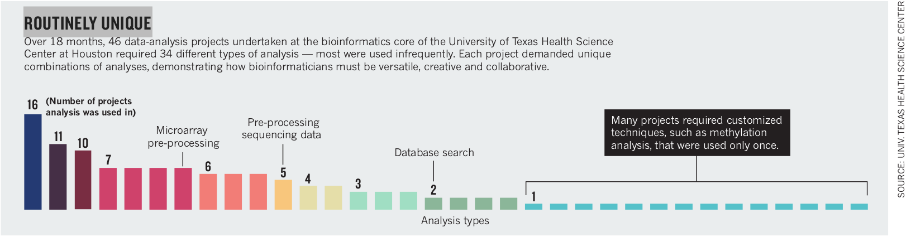
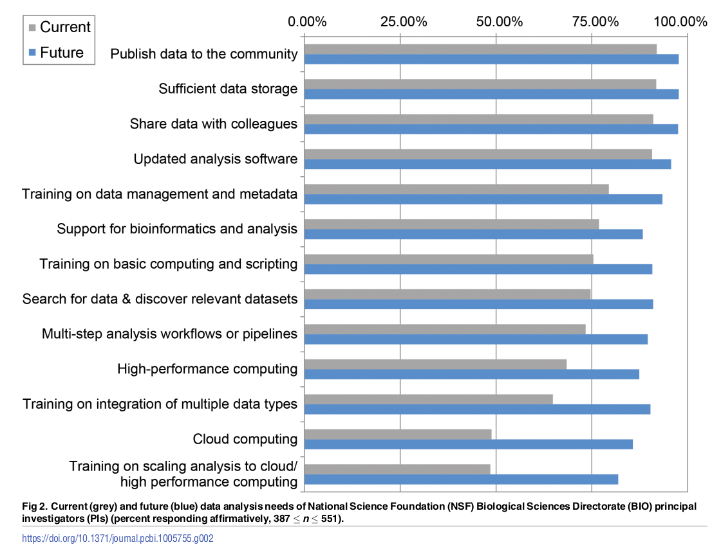
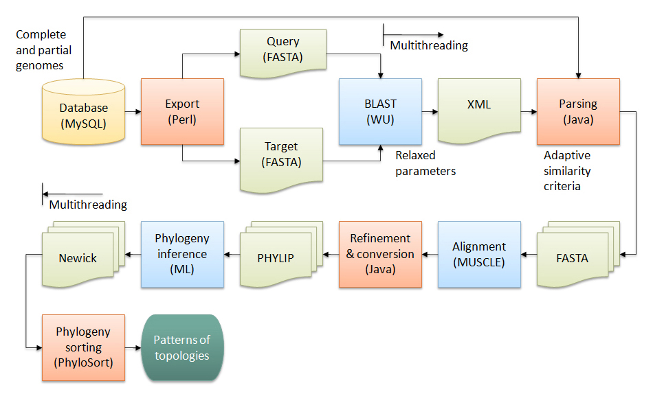

---

# Introduction

\bigskip
\bigskip

\large

> In a time where we see transitions towards biology as a data science, and towards a ‘life cycle’ view of research data

\normalsize

\begin{center}
    \includegraphics[width=0.5\textwidth]{img/datacycle.png}
\end{center}

\footnotesize

\vfill

Griffin *et al.* 2017, F1000Research

\normalsize


---

# Introduction




---

# Introduction




---

# Bioinformatics - What's in a Word?

\begin{center}

\includegraphics[width=0.8\textwidth]{img/studying_DNA.jpg}

"Scientist studying DNA sequences"

\end{center}


---

# Bioinformatics is...

- "The application of information technology to the field of molecular biology" ([wikipedia.org](wikipedia.org))

. . .

- Collection, archiving, organization, and interpretation of biological data

. . .

- Use of computers to address problems that are specific to biologists

. . .

- Informational technology + computer science + mathematics and statistics


---

# A Bioinformatician is, then, Someone who...

- Applies information technology to the field of molecular biology
\medskip
- Collects, archives, organizes, and interprets biological data
\medskip
- Uses computers to address problems that are specific to biologists
\medskip
- Uses informational technology + computer science + mathematics and statistics
\medskip


---

# Hi, my name is Johan, and I'm a Bioinformatician

\Large

Anyone else who wants to share?

\normalsize


---

# What Other's Need Bioinformaticians to Be

(The following are quotes from job ads)

. . .

- Individual with a superior understanding of **biology**, **computer science**, and the latest trends in analyzing big data

. . .

- Have strong communication skills and ability to tell a story using numbers and data

. . .

- Ability to apply advanced statistical methods, machine learning, data science to molecular biology


---

# What Other's Need Bioinformaticians to Be

- Strong background in programming and algorithms

\smallskip

- Fluent in one programming language (Python, C, C++ or Java) and familiarity with scripting languages (bash, Perl, R)

. . .

- Expert knowledge of Unix operating system, and High-performance computing (HPC) systems


---

# What Other's Need Bioinformaticians to Be

- Have hands-on experience with bioinformatics methods appropriate for NGS applications (targeted sequencing, RNASeq, CHiPSeq, and de novo genome assembly)

\smallskip

- Have hands-on experience with genome alignment, mapping, variant calling and annotation (e.g. BWA, Bowtie, STAR, GATK, samtools, bcftools)


---

# What Other's Need Bioinformaticians to Do

- Provide advanced bioinformatics analyses within research projects

. . .

- Development of tools and workflows for such analyses


---

# What Other's Need Bioinformaticians to Do

- Develop custom databases and web portals for managing raw and processed experimental data

. . .

- Design and implement reusable bioinformatics analysis pipelines for processing next-generation sequencing, microarray, genomics, proteomics and chemogenomics data

. . .

- Develop novel algorithms and integrated data visualization applications when existing software packages are not available or are not adequate


---

# What Other's Need Bioinformaticians to Do

- Educating other scientists in bioinformatics through collaboration within supported projects, teaching at national courses, and through participating in various networks

. . .

- Participating in the writing of scientific articles


---

# What Other's Need Bioinformaticians to Do

- Need to successfully deliver key insights to achieve greatness across our products

. . .

- Perform other duties as required


---

# One Real Example of Skills Requirements

*The following profiles are expected:*

1. Analysis of standard HTS data (variant calling, genome assembly, differential expression, ...),
2. Metagenomics
3. Metatranscriptomics
4. Single-cell analysis
5. Analysis of metabolomic data
6. Epigenomics and epitranscriptomics
7. Flux cytometry data analysis
8. Biological databases
9. Proteomics (Mass Spectrometry for Biology)
10. Omics data analysis and integration


---

# What Other's Need Bioinformaticians to Be

- A Bachelor's degree in **life sciences** or **computational sciences** is required, although a MSc or PhD is preferred.
- Master's degree in Computer Science or **Bioinformatics** or a related computational discipline, or equivalent experience
- PhD or MSc in Bioinformatics, Computer Science, Computational Biology, Electrical Engineering/Signal processing or a related field with > 1 years' experience


---

# A Bioinformatician is Not a Unicorn

\Large

- A biologist may have broad knowledge of biology, but will have expertise in just part

. . .

- Similarly, \bf{a bioinformatician is not universal}

\normalsize


---

# Common Expected Duties?

\Large

- **Organize** other people's data
- **Analyze** other people's data
- **Educate** other people in the field of bioinformatics
- **Support** other people in analysis
- **Develop** tools for other people to use

\normalsize


<!--

---

# What Other's Need Bioinformatiticans to Be

\Large

- The expected competence(s) can then perhaps be seen as something that is lacking among research groups?
- Or is it just that they lack another set of hands (time and money, that is)?

\normalsize

-->


---

# Things that Bioinformaticians Do - and How Much of What?

\Large

- **Organize** ~ 20%
- **Analyze** ~ 20%
- **Educate** ~ 20%
- **Support** ~ 30%
- **Develop** ~ 10%

\normalsize


---

# Things that Bioinformaticians Do - and How Much of What?

\Large

85% of the time a bioinformatician does "research"!

\bigskip

\normalsize



\footnotesize

\vfill

Chang 2015 Nature Communications

\normalsize


---

# Career Opportunities and Salaries for Bioinformaticians?

\Large

- Need to offer career opportunities for bioinformatitians - Can you?
- Academic suicide if not first or last author in a world based on counting publications
- Competetive salaries in academia?

\normalsize


---

# Getting Bioinformatics Done - By Whom?

\Large

- You?
- Your students?
- Your postdocs?
- Your collaborators?
- ...
- A company?

\normalsize


---

# Getting Bioinformatics Done - By Whom?

\Large

- You?
- Your students?
- Your postdocs?
- Your **collaborators**?
- ...
- A company?

\normalsize


---

# What Should I Learn?

\begin{center}
    \includegraphics[width=0.5\textwidth]{img/datacycle.png}
\end{center}


---

# What Should I Learn?




---

# What Should I Learn - As a Minimum?


---

# What Should I Learn - As a Minimum?

\Large

- Be able to look at your data?
    - Locate your data
    - Learn how to identify the "non-reproducible" parts of the data
    - Transfer data
    - ...

\normalsize


---

# What Should I Learn - As a Minimum?

```bash

$ sshfs user-delivery01234@grus.uppmax.uu.se: ~/grus
$ firefox ~/grus/P12345/00-Reports/*multiqc_report.html
$ backup2nrm ~/grus/P12345

```


---

# What Should I Learn - As a Minimum?

\Large

- Be able to look at your data?

- Other suggestions?

\normalsize


---

# Do I Need to Learn Programming?

. . .

\LARGE

No, but Why not?

\normalsize


---

# Some Words of Comfort:

\Large

- Actually programming can be easy
- Doesn't require knowledge of computer science

\normalsize


---

# Some Words of Comfort:

\Large

- A script is like a protocol:

\normalsize

```bash
for infile in *.fas
do
  alifile="${infile%.fas}.ali"

  # 1. Do multiple sequence alignment
  mafft --auto "$infile" > "$alifile"

  # 2. Infer a phylogenetic tree
  iqtree -s "$alifile" -nt AUTO -m TEST

done

```


---

# Some Words of Comfort:

\Large

- You start with an existing one and tweak it

\normalsize

{ witdh=50% }


---

# Some Words of Comfort:

\Large

You have a big advantage over the bioinformaticians:

- You generated the data
- You understand the biology
- You understand how things go wrong

\normalsize


---

# Learn How to Visualize Your Data

\Large

- Great for learning about the data
- Easy to pick out ouliers and trends

\normalsize

\begin{center}
    \includegraphics[width=0.5\textwidth]{img/pie-chart.jpg}
\end{center}


---

# Learn How to Visualize Your Data: Example

\LARGE

<https://www.r-graph-gallery.com/>

\normalsize


---

# Learn How to Visualize Your Data: Example

\begin{center}
    \includegraphics[width=1.0\textwidth]{img/r-graph-gallery-1.png}
\end{center}


---

# Learn How to Visualize Your Data: Example

\begin{center}
    \includegraphics[width=1.0\textwidth]{img/r-graph-gallery-2.png}
\end{center}


---

# Learn How to Visualize Your Data: Example

\begin{center}
    \includegraphics[width=1.0\textwidth]{img/r-graph-gallery-3.png}
\end{center}


---

# Learn How to Visualize Your Data: Example

```R
library(ggridges)
library(ggplot2)
ggplot(diamonds, aes(x = price, y = cut, fill = cut)) +
  geom_density_ridges() +
  theme_ridges() + 
  theme(legend.position = "none")
```

---

# Do I Need to Learn Programming?

\Large

- Well, up to you (your loss...)

. . .

- \bf{Have your student(s) learn programming!}

    - Include a programming course as part of their PhD 
    - Have your student(s) gather other students in "study circles"


---

# Courses and Teach Yourself

\LARGE

<https://tess.elixir-europe.org/>

\normalsize

\begin{center}
    \includegraphics[height=5cm]{img/bioinformatics-data-skills.jpg}\hspace{1.5cm}%
    \includegraphics[height=5cm]{img/getting-started-with-r.jpg}
\end{center}

