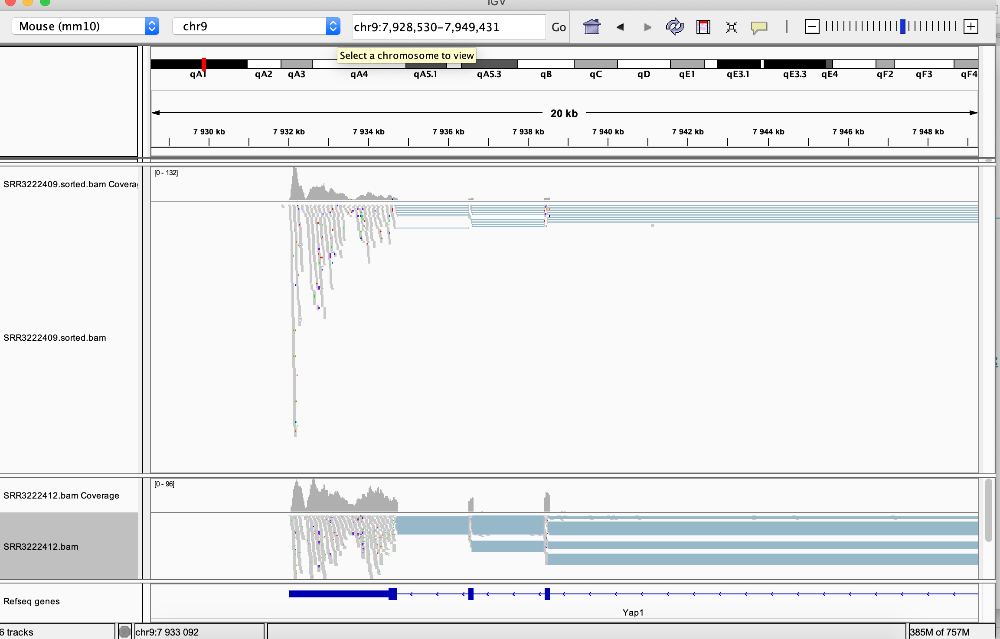
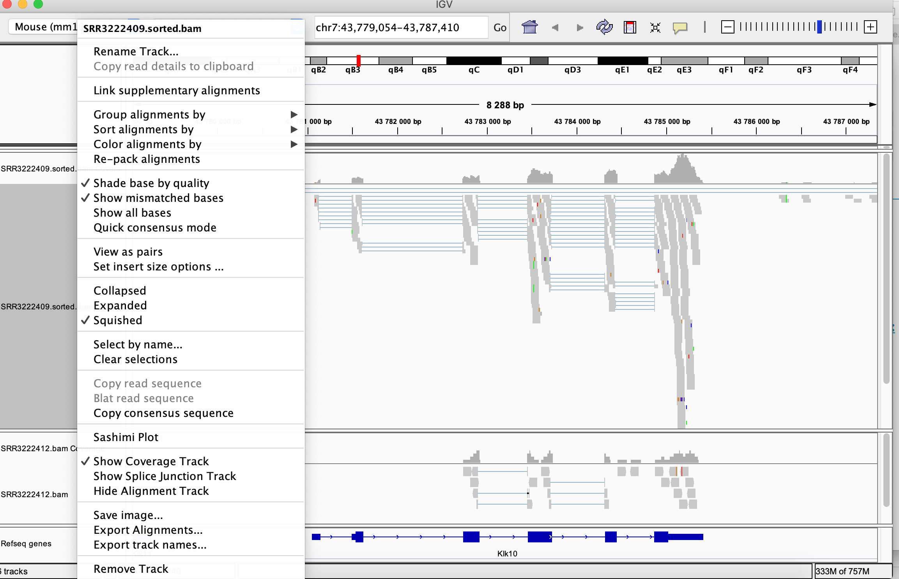
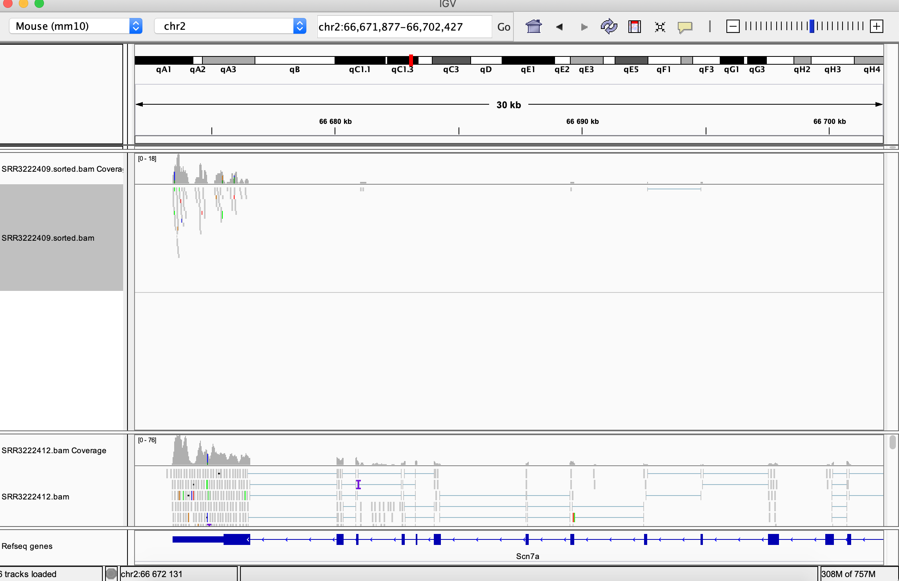

## Introduction
This tutorial will take you through a basic hands-on skills to be able to:

1. navigate in unix environment & preview folders and files
2. transfer data via `scp` between Uppmax and a local computer
3. clone Github repository
4. run basic bioinformatics tools to assess quality of the NGS data

## Basic unix commands
We will practice on Rackham, Uppmax.

**Logging in**
```bash
ssh -Y username@rackham.uppmax.uu.se
```

Now your screen should look something like this:
```
_   _ ____  ____  __  __    _    __  __
| | | |  _ \|  _ \|  \/  |  / \   \ \/ /   | System:    rackham1
| | | | |_) | |_) | |\/| | / _ \   \  /    | User:      olga
| |_| |  __/|  __/| |  | |/ ___ \  /  \    |
\___/|_|   |_|   |_|  |_/_/   \_\/_/\_\   |

###############################################################################

       User Guides: http://www.uppmax.uu.se/support/user-guides
       FAQ: http://www.uppmax.uu.se/support/faq

       Write to support@uppmax.uu.se, if you have questions or comments.
```

**Moving and looking around**

When you connect to UPPMAX, you will start out in your home folder. The absolute path to your home folder is usually **/home/\<username\>**

`pwd` command, to see where you are use `pwd` command, abbreviation for **p**rint **w**orking **d**irectory
```bash
pwd
```
This is what I see
```bash
[olga@rackham1 ~]$ pwd
/home/olga
```


`ls` command, to list directory content, abbreviation for **l**i**s**t.

```bash
ls

# ls with some options, indicated by a hyphen
ls -l
ls -l -h
ls -lh
```

You should have something similar to:
```bash
[olga@rackham1 ~]$ ls -l
total 44
drwxr-xr-x 2 olga olga    4096 Aug  7 11:01 bin
drwxrwxr-x 3 olga olga    4096 Sep 10 09:12 example-data
drwxr-x--- 3 olga olga    4096 Mar  2  2017 glob
drwxr-xr-x 8 olga olga    4096 Sep  6 10:04 homer-ctcf-04
drwxrwxr-x 4 olga olga    4096 Jan 28  2014 local
drwxrwxr-x 2 olga courses 4096 Nov 21  2017 olga
drwxrwxr-x 3 olga olga    4096 Feb 13  2013 opt
drwx--S--- 2 olga olga    4096 Jan 18  2017 private
drwxrwxr-x 6 olga olga    4096 Oct 15  2018 R
drwxrwxr-x 7 olga olga    4096 Aug  9 16:32 tools
drwxrwxr-x 4 olga olga    4096 Jan 27  2019 transfer-mast
```

`man` command. In the above examples, as you may have noticed, -l or -h is an option of the command `ls` that alters its default behaviour. To read about a command and available options we use another command `man`, abbreviation for **man**ual
```bash
# manual for ls
man ls

# manual for pwd
man pwd

# manual for man
man man

```


More basic commands:
```bash
# Let's create a folder for this tutorial (mkdir, from make directories)
mkdir bip

# Let's navigate to this folder (cd, from change directory)
cd bip

# Print pathway to the folder
pwd

# Go back to the home directory (cd with no options)
cd

# Go back to bip using full pathway
cd /home/username/bip

# Go back to home directory using full pathway
cd /home/username/
```

What do you have in the folder? How do you check again?

**Running a script**

We have prepared some files to practice with and a small script that links these files to your home directory.

```bash
# go to home directory and "bip" folder
cd ~/bip

# copy setup.sh script
cp /sw/share/compstore/courses/bip/hands-on/scripts/setup.sh .

# run script
./setup.sh

# check content of the "bip" folder
ls -lh

# check content of the "bip/data"
ls -lsh data
```

**Looking into files**


`head`, `tail` and `less` command come handy when looking into files

To get access to the `hsa.gff3` file:

```
cp /proj/g2019018/nobackup/data/hsa.gff3 .
```


```bash

# navigate to data directory
cd ~/bip/data

# output the first 10 lines of the .fastq file
head -n 10 P12516_101_R1.sample.fastq

# output the last 20 lines fo the .fastq file
tail -n 20 P12516_101_R1.sample.fastq

# preview .bed files
less CGATGG.bed

# while previewing the CGATG.bed file type search for entries with chr11
./chr11

# have a look at microRNA annotations file
less hsa.gff3

# can you find "hsa-miR-608"?
./hsa-miR-608

# what happens when you use grep command?
grep hsa-miR-608 hsa.gff3
```


**Data size**
```bash

# Navigate to "bip" folder
cd ~/bip

# estimate file space usage
du data/

# try some useful du options
du -a
du -h
du -ah

```

* To read more: [https://scilifelab.github.io/courses/ngsintro/1905/slides/linux-tutorial.pdf](https://scilifelab.github.io/courses/ngsintro/1905/slides/linux-tutorial.pdf)
* Useful to have: [https://scilifelab.github.io/courses/ngsintro/common/files/Bash_cheat_sheet_level1.pdf](https://scilifelab.github.io/courses/ngsintro/common/files/Bash_cheat_sheet_level1.pdf)
* To practice more: [https://scilifelab.github.io/courses/ngsintro/1905/labs/linux-intro](https://scilifelab.github.io/courses/ngsintro/1905/labs/linux-intro)

## Data transfer
`scp`, secure copy is used to copy files between hosts on a network

To try it out, open in parallel a terminal window on your local computer and Uppmax terminal

```bash
# to transfer a file from Rackham to local current directory (denoted by a dot)
scp <userame>@rackham.uppmax.uu.se:/home/<username>/bip/data/example.bed  .

# to transfer files from Rackham to local current directory (denoted by a dot)
scp -r <userame>@rackham.uppmax.uu.se:/home/<username>/bip/data .

# to transfer files in data directory from local to Rackham home directory
scp -r data/ <username>@rackham.uppmax.uu.se:/<username>/olga

```

## Cloning Github repository
The course website is hosted under: [https://nbisweden.github.io/workshop-bioinformatics-for-PIs/](https://nbisweden.github.io/workshop-bioinformatics-for-PIs/). Have you noticed "github" part in the address? In fact, in the background we have prepared and submitted all the materials for this course to a Github repository. Github, apart from hosting and tracking code, offers rendering options to a project website, like the one above. The course Github repository is here: [https://github.com/NBISweden/workshop-bioinformatics-for-PIs](https://github.com/NBISweden/workshop-bioinformatics-for-PIs). Have a look at it? Does it look familiar to the website?

To download the repository, one could use `Download Zip` button. The repository downloads as a plain folder then, one can access materials but changes cannot be tracked. To work reproducibly and collaboratively with the code, keeping track of the changes, one would instead
1. clone the repository to a local computer
2. checkout a working branch to work on
3. while working modify and/or add code to the working branch
4. commit changes, with a message describing the changes
5. push the branch to the Github repository
6. on Github, one would make a `Pull request` to merge changes from the working branch to the master branch.

##### To try it out
Go to [https://github.com](https://github.com) and create an account.

```bash

# clone repository
git clone https://github.com/NBISweden/workshop-bioinformatics-for-PIs.git

# navigate into the repo and to session-git folder
cd workshop-bioinformatics-for-PIs/session-git

# checkout out working branch, e.g. feature-olga
git checkout -b feature-olga

# create a file with your contribution e.g. "My contribution"
echo "My contribution" > file-<username>.txt

# add file
git add file-<username>.txt

# commit changes
git commit -m "Initiate file-<username>.txt"

# push changes
git push

```
Now you can go to https://github.com/NBISweden/workshop-bioinformatics-for-PIs.git and  click on a `New pull request`. Your collaborators can view the changes, ask for modifications, or incorporate the changes under the master project branch.

P.S. The above will also work on a local computer with .git installed

* Read more: [https://coderefinery.github.io/git-intro/](https://coderefinery.github.io/git-intro/)


## <a name="begin"></a> Bioinformatics tools: RNA-seq data processing and QC tutorial
A part of the bioinformatics work is to use already developed bioinformatics tools, i.e. software programs, designed for extracting information, processing data, and to carry out various data analysis tasks, e.g. sequence or structural analysis. Many of these tools are open-source and are already installed on UPPMAX. Others, may need to be installed according to needs. At [https://bio.tools](https://bio.tools) one can search through the most common ones.

Here, we will work with few of these tools and see how they can be put together to run a simple RNA-seq data processing workflow.

##### Briefly about UPPMAX computational resources
Up until now we have been trying various unix commands on Rackham under home directory.  This works fine, if we are navigating around and looking into files. Usually running bioinformatics tools requires more computational resources, and to address the resources usage most clusters have a system to allow fair and efficient usage. UPPMAX uses [Slurm](https://www.uppmax.uu.se/support/user-guides/slurm-user-guide/) and one can run tools in batch mode or interactively. To keep it simple, one could say that in batch mode one submits jobs to a queue where they run in the background when the resources, cores and/or nodes, become available. Login nodes can be also used interactively, to quickly test algorithms, run smaller analysis or explore the computing environment, and this is how we will work now.

We will also work under UPPMAX project `g2019018` which we have created for this course. This is because at UPPMAX home directory comes with a very limited storage space, and one uses computational projects for processing power and storage projects for storing the data [https://www.uppmax.uu.se/support/getting-started/applying-for-projects/](https://www.uppmax.uu.se/support/getting-started/applying-for-projects/).

##### Setting-up
:computer: **Create a directory**
Create a working directory named with your UPPMAX user name `<username>` in the `/proj/g2019018/nobackup/` directory. Remember to replace `<username>` with your UPPMAX id throughout the exercise.

```bash
mkdir /proj/g2019018/nobackup/<username>
```

:computer: **Book a node**
We have reserved half a node per person.
Please book a node only once, as otherwise you'll be taking resources from your fellow course participants.

```bash
salloc -A g2019018 -t 03:30:00 -p core -n 10 --no-shell --reservation=g2019018_1
```

Now you can check which node you have booked:
```bash
jobinfo -u <username>
```

In the following example *r278* is the node booked (scroll right):

```
CLUSTER: rackham
Running jobs:
   JOBID PARTITION                      NAME     USER        ACCOUNT ST          START_TIME  TIME_LEFT  NODES CPUS NODELIST(REASON)
10033342      core              interactive    agata       g2019018  R 2019-09-12T11:41:13    9:58:24      1    1 r278
```


Connect to your node:

```bash
ssh <node>
```

##### Briefly on RNA-seq workflow

RNA-seq has become a powerful approach to study the continually changing cellular transcriptome. Here, one of the most common questions is to identify genes that are differentially expressed between two conditions, e.g. controls and treatment. In this short introductory exercise we will present a workflow for QC and processing data from an RNA-seq experiment to try out some of common bioinformatics tools, here already installed on UPPMAX.

Briefly we will,

  * check the quality of the raw reads with [FastQC](#fastqc)
  * convert between SAM and BAM files format using [Samtools](#samtools)
  * assess the post-alignment reads quality using [QualiMap](#qualimap)
  * aggregate different reports using [MultiQC](#multiqc)
  * view RNA-seq bam files in a genome browser [IGV](#igv)

##### Data description

The data you will be using in this exercise is from the paper [YAP and TAZ control peripheral myelination and the expression of laminin receptors in Schwann cells. Poitelon et al. Nature Neurosci. 2016](http://www.nature.com/neuro/journal/v19/n7/abs/nn.4316.html). In the experiments performed in this study, YAP and TAZ were knocked-down in Schwann cells to study myelination, using the sciatic nerve in mice as a model.
For the purpose of this tutorial, that is to shorten the time needed to run various bioinformatics steps, we have down-sampled the original files. We randomly sampled, without replacement, 25% reads from each sample, using fastq-sample from [fastq-tools](http://homes.cs.washington.edu/~dcjones/fastq-tools/).

<br />
[Jump to the top](#begin)

##### File preparation

First, create the new working directory and link the raw data `fastq.gz` files.


```bash
# Navigate to your folder under g2019018
cd /proj/g2019018/nobackup/<username>/

# Create transcriptome and DATA directory, navigate to it
mkdir -p transcriptome/DATA
cd transcriptome/DATA

ln -s /proj/g2019018/nobackup/data/SRR3222409_1.fastq.gz
ln -s /proj/g2019018/nobackup/data/SRR3222409_2.fastq.gz
ln -s /sw/courses/ngsintro/rnaseq/main/SRR3222409_1.fastq.gz
```

:white_check_mark: **Check** if you linked the files correctly. You now should be able to see 2 links to the .fastq.gz files. (scroll right)
```bash
ll

lrwxrwxrwx 1 agata g2019018 50 Sep 14 14:59 SRR3222409_1.fastq.gz -> /proj/g2019018/nobackup/data/SRR3222409_1.fastq.gz
lrwxrwxrwx 1 agata g2019018 50 Sep 14 14:59 SRR3222409_2.fastq.gz -> /proj/g2019018/nobackup/data/SRR3222409_2.fastq.gz

```
<br/>
<br />

[Jump to the top](#begin)


##### <a name="fastqc"></a> FastQC: quality check of the raw sequencing reads
After receiving raw reads from a high throughput sequencing centre it is essential to check their quality. Why waste your time on data analyses of the poor quality data? Also, importantly, being aware of any quality pitfalls allows for adapting a filtering and preprocessing strategy to "clean up" the data.
FastQC provide a simple way to do some quality control check on raw sequence data. It provides a modular set of analyses which you can use to get a quick impression of whether your data has any problems of which you should be aware before doing any further analysis.

:mag: **Read** more on [FastQC](http://www.bioinformatics.babraham.ac.uk/projects/fastqc/). Can you figure out how to run it on Uppmax?  
<br />

:computer: **Create** *fastqc* folder in your _transcriptome_ directory. **Navigate to _fastqc_ folder**.
```bash
mkdir /proj/g2019018/nobackup/<username>/transcriptome/fastqc
cd /proj/g2019018/nobackup/<username>/transcriptome/fastqc
```
<br />

:computer: **Load** _bioinfo-tools_ and _FastQC_ modules
```bash
module load bioinfo-tools
module load FastQC/0.11.8
```

`FastQC` is already installed on UPPMAX. UPPMAX uses [module system](https://www.uppmax.uu.se/resources/software/module-system/) to organise the installed software, hence to activate `FastQC` we are using module load command. All bioinformatics tools on Uppmax are under `bioinfo-tools` module.

<br />

:computer: **Run** FastQC on all `.fastq.gz` files located in the _transcriptome/DATA_. **Direct the output** to the  _fastqc_ folder. :bulb: Check the FastQC option for input and output files. :bulb:

```bash
fastqc /proj/g2019018/nobackup/<username>/transcriptome/DATA//SRR3222409_1.fastq.gz -o /proj/g2019018/nobackup/<username>/transcriptome/fastqc/
```
To read more about `FastQC` try ``--help`` flag (will work with many of the tools)
```bash
fastqc --help
```

To run `FastQC` on all the files, we could also use a loop (slightly more advanced)
```bash
for i in /proj/g2019018/nobackup/<username>/transcriptome/DATA/*.fastq.gz
do
fastqc $i -o /proj/g2019018/nobackup/<username>/transcriptome/fastqc/
done
```
<br />

Check which files were generated in the _fastqc_ folder:

```bash
ll

total 501
-rw-rw-r-- 1 agata g2019018 241794 Sep 14 15:01 SRR3222409_1_fastqc.html
-rw-rw-r-- 1 agata g2019018 265945 Sep 14 15:01 SRR3222409_1_fastqc.zip
-rw-rw-r-- 1 agata g2019018 242957 Sep 14 15:02 SRR3222409_2_fastqc.html
-rw-rw-r-- 1 agata g2019018 266255 Sep 14 15:02 SRR3222409_2_fastqc.zip
```

:mag: **Download** the FastQC for the proceeded sample from UPPMAX to your local computer and **have a look** at it. **Go back** to the [FastQC](http://www.bioinformatics.babraham.ac.uk/projects/fastqc/) website and **compare** your report with [Example Report for the Good Illumina Data](http://www.bioinformatics.babraham.ac.uk/projects/fastqc/good_sequence_short_fastqc.html) and [Example Report for the Bad Illumina Data](http://www.bioinformatics.babraham.ac.uk/projects/fastqc/bad_sequence_fastqc.html) data.  

```bash
scp <username>@rackham.uppmax.uu.se:/proj/g2019018/nobackup/<username>/transcriptome/fastqc/*html .
```

:open_mouth: Discuss whether you'd be satisfied receiving these data from a sequencing facility.
<br />
<br />
[Jump to the top](#begin)

##### <a name="samtools"></a> Conversions of bam files

In this exercise we skip the read mapping step in the interest of time. The reads were mapped to the mouse reference genome `GRCm38` from Ensembl, which correspnds to `mm10` in the UCSC notation. The aligner used was `STAR`, version 2.7.0e [link to the current version](https://github.com/alexdobin/STAR).
We will perform some useful manipulations on alignment files.

:computer: **Create** new folder in your working directory and link a file with read alignments in a frequently used human-readable format `sam`:

```bash
mkdir /proj/g2019018/nobackup/<username>/transcriptome/bam
cd /proj/g2019018/nobackup/<username>/transcriptome/bam

ln -s /proj/g2019018/nobackup/data/SRR3222409_Aligned.out.sam
```

To inspect the contents of a `sam` file type:

```bash
head SRR3222409_Aligned.out.sam
```

You can see the first lines of the header - information on sequences in the reference used for read mapping followed by information appended by software that produced and modified the file. You can view the entire header using `samtools`, a collection of utilities for processing `sam` / `bam` format:

```
samtools view -H SRR3222409_Aligned.out.sam > header.txt

head header.txt
tail -n 10 header.txt
```
:mag: To find out more about `sam` / `bam` format and `samtools` check their respective documentation:
[samtools](http://www.htslib.org/doc/samtools.html)
[SAM](https://samtools.github.io/hts-specs/SAMv1.pdf)

`sam` format albeit easy to read by human eyes, it is not very practical for data storage because as it not compressed, it uses a lot of space. The binary version of it `bam` is employed instead. It is very easy to convert between them.

:computer: **Convert between sam and bam** formats:

```bash
samtools view -hbo SRR3222409.bam SRR3222409_Aligned.out.sam
```
:computer: **Sort** the alignments by the _starting position_ of each read (this is the default sorting strategy and required by most applications unless stated otherwise):

```bash
samtools sort -T tmpdir -o SRR3222409.sorted.bam SRR3222409.bam
```
:computer: Finally, **index** the `bam` file. This is necessary for many downstream applications.

```bash
samtools index SRR3222409.sorted.bam
```

You can check the contents of the directory using `ll`:

```bash
total 1051316
lrwxrwxrwx 1 agata g2019018        55 Sep 14 15:03 SRR3222409_Aligned.out.sam -> /proj/g2019018/nobackup/data/SRR3222409_Aligned.out.sam
-rw-rw-r-- 1 agata g2019018 537824395 Sep 14 15:11 SRR3222409.bam
-rw-rw-r-- 1 agata g2019018 536868854 Sep 14 15:17 SRR3222409.sorted.bam
-rw-rw-r-- 1 agata g2019018   1839552 Sep 14 15:17 SRR3222409.sorted.bam.bai
```

We will link more bam files and their mapping logs required in further steps:

```bash
ln -s /proj/g2019018/nobackup/data/SRR3222412.bam
ln -s /proj/g2019018/nobackup/data/SRR3222412.bam.bai


for i in /proj/g2019018/nobackup/data/*Log.final.out
do
ln -s $i
done
```

The `transcriptome/bam` directory should look like this:


```bash
lrwxrwxrwx 1 agata g2019018        55 Sep 14 15:03 SRR3222409_Aligned.out.sam -> /proj/g2019018/nobackup/data/SRR3222409_Aligned.out.sam
-rw-rw-r-- 1 agata g2019018 537824395 Sep 14 15:11 SRR3222409.bam
lrwxrwxrwx 1 agata g2019018        52 Sep 14 15:20 SRR3222409Log.final.out -> /proj/g2019018/nobackup/data/SRR3222409Log.final.out
-rw-rw-r-- 1 agata g2019018 536868854 Sep 14 15:17 SRR3222409.sorted.bam
-rw-rw-r-- 1 agata g2019018   1839552 Sep 14 15:17 SRR3222409.sorted.bam.bai
lrwxrwxrwx 1 agata g2019018        43 Sep 14 15:19 SRR3222412.bam -> /proj/g2019018/nobackup/data/SRR3222412.bam
lrwxrwxrwx 1 agata g2019018        47 Sep 14 15:19 SRR3222412.bam.bai -> /proj/g2019018/nobackup/data/SRR3222412.bam.bai
lrwxrwxrwx 1 agata g2019018        52 Sep 14 15:20 SRR3222412Log.final.out -> /proj/g2019018/nobackup/data/SRR3222412Log.final.out
```

We will use the `bam` files and their indices `bam.bai` for viewing in a genome browser [IGV](#igv).

<br />
[Jump to the top](#begin)

##### <a name="qualimap"></a> Qualimap: post-alignment QC

This QC steps yields information related to the contents of the sample, such as which regions most of the reads map to, distribution of reads along gene bodies, the frequency of the splice sites, etc.
The metrics gathered in this exercise are by no means exhaustive, nor is Qualimap the only application for post-alignment QC.

Qualimap requires `bam` files to be sorted by _read name_ rather than the position.

:computer: **Sort** the alignments by _read name_ of each read (assuming your current directory is `/transcriptome/bam`):

```bash
samtools sort -n -T tmp -o SRR3222409.nsorted.bam SRR3222409.bam
samtools sort -n -T tmp -o SRR3222412.nsorted.bam SRR3222412.bam
```

Create and navigate to appropriate output directory:

```bash
mkdir /proj/g2019018/nobackup/<username>/transcriptome/qualimap
cd /proj/g2019018/nobackup/<username>/transcriptome/qualimap
module load QualiMap/2.2
```

:computer: **Execute Qualimap** for sample `SRR3222409`:

```bash
qualimap rnaseq -pe -bam /proj/g2019018/nobackup/<username>/transcriptome/bam/SRR3222409.nsorted.bam -gtf /proj/g2019018/nobackup/data/Mus_musculus.GRCm38.85.gtf --outdir /proj/g2019018/nobackup/<username>/transcriptome/qualimap/SRR3222409 --java-mem-size=63G -s > /dev/null 2>&1
```

You can now download the results and view them locally:

```bash
scp -r <username>@rackham.uppmax.uu.se:/proj/g2019018/nobackup/<username>/transcriptome/qualimap/SRR3222409 .
```


Now you can perform the same analysis for the second sample `SRR3222412`

<details>
<summary>:key: Click to see suggested commands</summary>

qualimap rnaseq -pe -bam /proj/g2019018/nobackup/<username>/transcriptome/bam/SRR3222412.nsorted.bam -gtf /proj/g2019018/nobackup/data/Mus_musculus.GRCm38.85.gtf --outdir /proj/g2019018/nobackup/<username>/transcriptome/qualimap/SRR3222412 --java-mem-size=63G -s > /dev/null 2>&1

</details>  
<br />

<br />
[Jump to the top](#begin)

##### <a name="multiqc"></a> MultiQC: creating quality reports


In this step we will perform aggregation of different QC metrics and application logs to create a report for the data set.

Our data set in this case consists of two samples only: `SRR3222409` is the knock-down of Yap1 and Taz, and `SRR3222412` is untreated. Only one biological replicate is included here in the interest of time, the original study consisted of three biological replicates per condition.


```bash
cd /proj/g2019018/nobackup/<username>/transcriptome
module load MultiQC/1.7
multiqc .
```

Yes, it is as simple as this! `MultiQC` searches all files in the current directory and its subdirectories and extracts information from relevant files. Its behaviour can of course be configured to suit the needs of your particular processing workflow, read more and view videos on [MultiQC homepage](https://multiqc.info).

```
scp <username>@rackham.uppmax.uu.se:/proj/g2019018/nobackup/<username>/transcriptome/multiqc_report.html .
```
<br />
[Jump to the top](#begin)

##### <a name="igv"></a> IGV: viewing the data

Finally, one can view the data directly in a genome browser. Here we will use `Integrated Genomics Viewer, IGV`.

[Integrated genomics viewer](http://software.broadinstitute.org/software/igv/) from Broad Institute is a graphical
interface to view `bam` files (as well as many other standard file formats used in genomics) and genome annotations. It also has tools
to export data and some functionality to look at splicing patterns in
RNA-seq data sets. Even though it allows for some basic types of
analysis it should be used more as a convenient way to look at your mapped
data. Looking at data in this way might seem like a daunting approach
as you can not check more than a few regions, but in many cases it
can reveal mapping patterns that are hard to catch with just summary
statistics.

You can download it from [IGV downloads page](https://software.broadinstitute.org/software/igv/download) if you haven't installed it yet. We recommend to download the newest version and use it locally rather than relying on the version installed on Uppmax.

Our data set in this case consists of two samples only: `SRR3222409` is the knock-down of Yap1 and Taz, and `SRR3222412` is untreated. Only one biological replicate is included here in the interest of time, the original study consisted of three biological replicates per condition.

You need to copy the `bam` and `bam.bai` files to your local computer.

```bash
scp <username>@rackham.uppmax.uu.se:/proj/g2019018/nobackup/<username>/transcriptome/bam/*ba* .
```

First, select the correct genome in the upper left corner. `mm10` is the genome the reads were mapped to. You may need to download the genome (`Genomes` > `Load Genome from Server`).

You can now load the data: `File` > `Load from File` and select each of the samples.

You can navigate to a desired location by specifying its genomic coordinates or just giving a gene name. You can check for example read coverage on Yap1 (the gene knocked-down in the experiment, i.e in the SRR3222412 sample).

{:width="700px"}

Many viewing options may be adjusted in the left hand side panel:

{:width="700px"}

Just to give you a handful of locations to look at, below are top differentially expressed genes in this experiment (knock-down vs. untreated).

MGI symbol | Description | logFC | FDR
--- | --- | --- | --- |
Klk10 | kallikrein related-peptidase 10 | 4.87 |3.85e-54 |
Col2a1 | collagen, type II, alpha 1 | 1.91 | 2.06e-41 |
Scn7a | sodium channel, voltage-gated, type VII, alpha | -2.82 | 2.53e-41 |
Tm7sf2 | transmembrane 7 superfamily member 2 | -2.15 | 8.97e-41 |
Sema6d | semaphorin 6D | -1.80 | 2.41e-37 |
Acat2 | acetyl-Coenzyme A acetyltransferase 2 | -1.93 | 6.03e-37 |
Frmd3 | FERM domain containing 3  | -2.36 | 1.32e-35 |
Vat1l | vesicle amine transport protein 1 like  | -3.24 |2.03e-34 |

Compare read coverage for one of the top DE genes, notice the difference in the scale in the coverage track:

{:width="700px"}

<br />
[Jump to the top](#begin)
