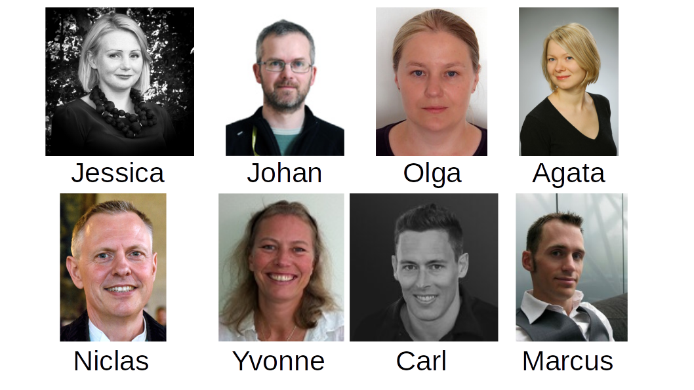

---

# Welcome!

---

# Welcome - Practical things first

- **Internet** (WiFi: Eduroam, KI, SciLifeLab, *KISP-GuestNet*)
- **Lunch**: Nanna Schwartz (walking distance) -- **Meal ticket!** 
- **Dinner** (Tuesday at ~18): Grappa Bar (S:t Eriksgatan 86, also walking distance)

- **Course web page**: <https://nbisweden.github.io/workshop-bioinformatics-for-PIs>

---

# Aim and Outcomes

After this course you should be able to:

- Define the potential and pitfalls of bioinformatics use in your research
- Identify your team needs in terms of bioinformatics use and support
- Develop appropriate plans for the management and sharing of data
- Support the development of bioinformatics skills within your team

---

# Expectations

> Opportunity to meet other PIs to share experiences

---

# Outline Day 1 (Tuesday, 09:30 ~ 17:00)

- Bioinformatics and Bioinformaticians - What is it, and What do they do?
- Getting Bioinformatics done - Collaboration and Collaborators
- Getting Bioinformatics done - Examples

---

# Outline Day 2 (Wednesday, 09:30 ~ 17:00)

- Data Management and Reproducability
- Data Generation
- Computational Resources

---

# Feedback and Disclaimer

- We would welcome feedback during and after the course

- This is a new course (you are the crash-test dummies)

